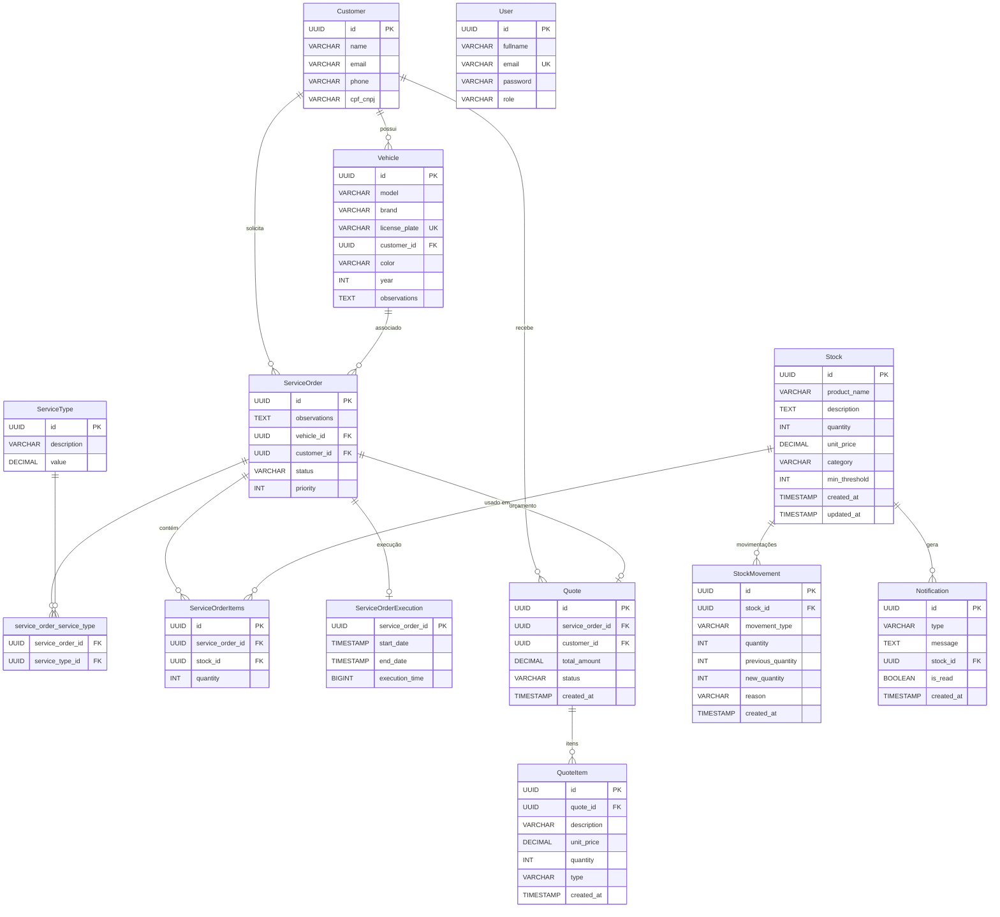

# garage-database-infra

Repositório Terraform dedicado à infraestrutura do banco de dados RDS PostgreSQL do projeto Garage. Este repositório gerencia a instância do banco de dados, security groups, subnet groups e parâmetros SSM de forma independente da infraestrutura cloud principal.

## Recursos Gerenciados

- **Instância RDS PostgreSQL** — `db.t3.micro` rodando PostgreSQL 16.11
- **DB Subnet Group** — Posiciona a instância RDS em subnets privadas em duas zonas de disponibilidade
- **Security Group do RDS** — Controla o ingress dos nós EKS e funções Lambda na porta 5432
- **Parâmetros SSM** — Publica `/garage/prod/db/endpoint` e `/garage/prod/db/secret_arn` para descoberta de serviços

## Pré-requisitos

- [Terraform](https://www.terraform.io/downloads) >= 1.5.0
- [AWS CLI](https://aws.amazon.com/cli/) configurado com credenciais válidas
- Acesso ao bucket S3 de estado: `garage-terraform-state-211125475874`
- O `garage-cloud-stack` deve ser aplicado primeiro (fornece VPC, subnets e outputs de rede)

## Ordem de Deploy

Este repositório depende dos outputs do `garage-cloud-stack`. Sempre siga esta ordem:

1. **garage-cloud-stack** — Aplicar primeiro para provisionar VPC, EKS, Lambda e expor outputs de rede
2. **garage-database-infra** — Aplicar segundo para provisionar o RDS e publicar parâmetros SSM
3. **tech-challenge** (deploy K8s) — Lê os detalhes de conexão do banco via parâmetros SSM

## Uso

```bash
cd infra
terraform init
terraform plan
terraform apply
```

## Estrutura do Repositório

```
garage-database-infra/
├── .github/
│   └── workflows/
│       └── pipeline.yml      # Pipeline CI/CD (dispara no push para master)
├── infra/
│   ├── main.tf               # Provider, backend, locals, remote state
│   ├── rds.tf                # Instância RDS e DB subnet group
│   ├── security_groups.tf    # Security group do RDS e regras de ingress
│   ├── ssm_parameter.tf      # Parâmetros SSM para endpoint e secret ARN do DB
│   ├── outputs.tf            # Outputs do Terraform
│   ├── variables.tf          # Variáveis de entrada
│   └── terraform.tfvars      # Valores das variáveis
├── docs/
│   └── MIGRATION.md          # Procedimento de migração de estado
└── README.md
```

## Diagrama de Entidades do Banco de Dados



## Migração

Se estiver migrando recursos RDS existentes do `garage-cloud-stack`, consulte [docs/MIGRATION.md](docs/MIGRATION.md) para o procedimento passo a passo de migração de estado.
